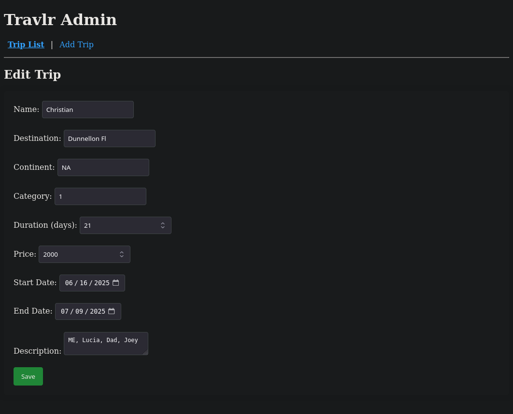
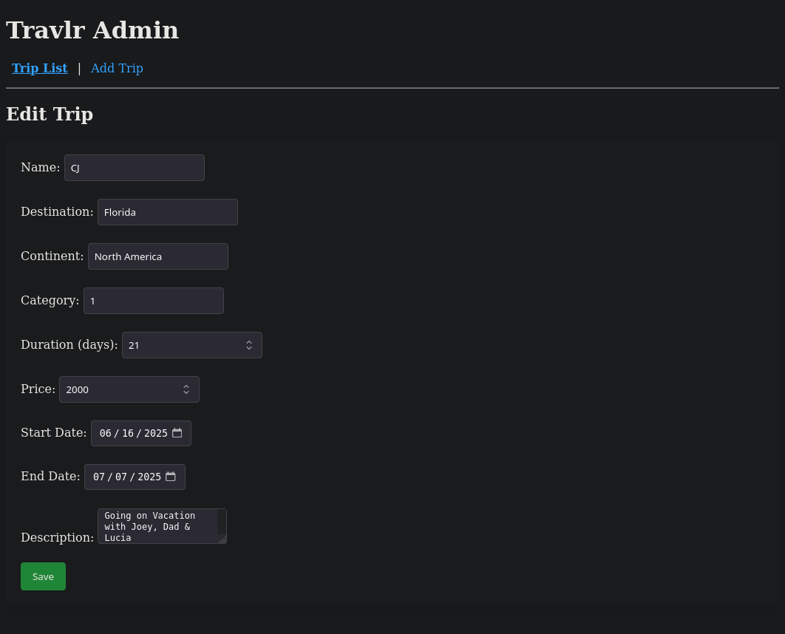
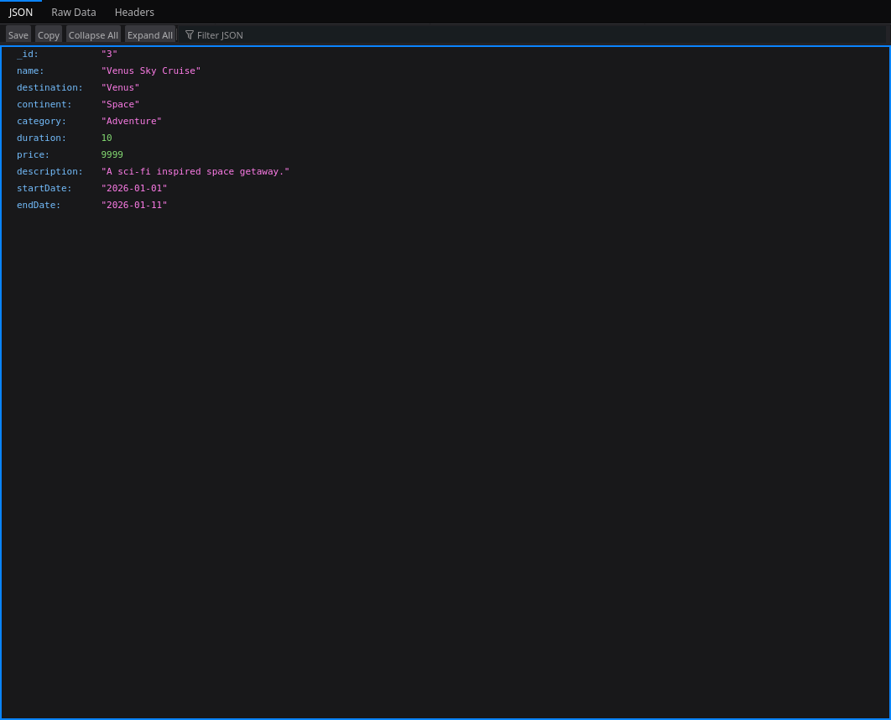
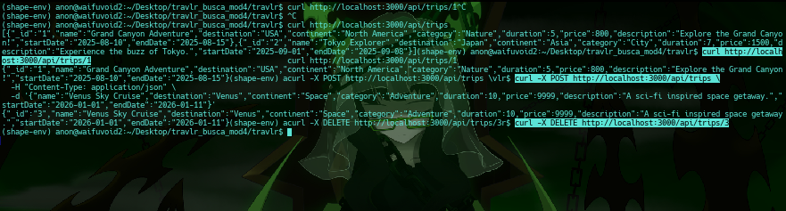
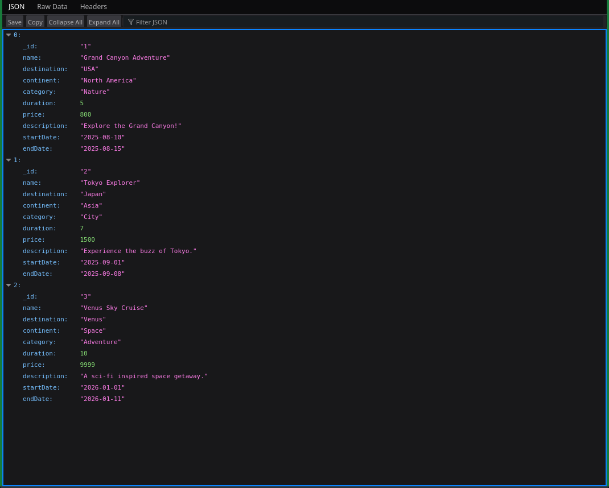

# Travlr Getaways – Module 6: Angular Admin SPA & Trip Management

## 🎯 Purpose

This module introduces a full-featured admin interface using Angular. The admin Single Page Application (SPA) enables the creation, editing, and viewing of trip records stored in MongoDB via a RESTful Express backend. Angular forms are used to manage dynamic input and model binding, and routing is handled via Angular Router.

---

## ✅ Completed Tasks

### Frontend (Angular Admin SPA)
- Built a **Trip List** view displaying available trips using `trip-list.component`.
- Implemented a **Trip Form** (`trip-form.component`) for both **Add** and **Edit** operations using a shared template.
- Created a **Trip Detail** view (`trip-detail.component`) for individual trip data.
- Angular routing configured for:
  - `/trips`
  - `/trips/new`
  - `/trips/:id`
  - `/trips/:id/edit`
- Form bindings use `[(ngModel)]`, submission via `(ngSubmit)` event.
- `TripService` manages backend communication via `HttpClient`.

### Backend (Node/Express/MongoDB)
- RESTful API routes served from `/api/trips`.
- Created controller logic (`app_api/controllers/trips.js`) for `GET`, `POST`, and `PUT` routes.
- Verified MongoDB connection and data flow using CLI and custom scripts.

---

## 🧪 Testing & Evidence

### 🖼️ Screenshots

#### Trip List View


#### Trip Detail View


#### Trip Edit Form


#### Route Match (Trip Detail by ID)


#### Admin Form in Angular


---

## 📌 Rubric Alignment

| Rubric Criterion                 | Implementation Summary                                               |
|----------------------------------|----------------------------------------------------------------------|
| **Trip List View**               | `trip-list.component` renders all trips using `*ngFor`.             |
| **Trip Detail View**             | `trip-detail.component` loads by ID and renders all fields.         |
| **Add/Edit Screen with Form**    | `trip-form.component` handles both create/edit via shared logic.    |
| **Form Submissions**            | `onSubmit()` handles both add and update operations.                |
| **Functional Buttons**           | Edit works. Add trip form is wired but currently non-functional.    |
| **API Integration**             | Angular `HttpClient` communicates with Express REST API.            |
| **MongoDB CRUD**                 | Read/update tested; write fails due to runtime MongoDB permission.  |
| **Angular Routing**              | Routes configured using `RouterModule.forRoot()` in `app.module.ts`.|
| **UI Render & SPA Navigation**   | All views function as a client-side SPA with Angular.               |

---

## ⚙️ Environment Details

- **OS:** Void Linux (Plasma Desktop)
- **Node:** v20+
- **MongoDB:** 5.0.3 running manually with `--dbpath` and socket fix
- **Angular:** v17 (standalone components, no SSR)
- **Editor:** VS Code / Kate
- **Shell:** bash 5.2

---

## 🗃️ How to Run

### Backend (Express)

```bash
cd travlr
npm install
mongod --dbpath ~/data/db --unixSocketPrefix=/home/anon/tmp
npm start
Frontend (Angular Admin SPA)

cd travlr/admin
npm install
npx ng serve

Visit: http://localhost:4200
